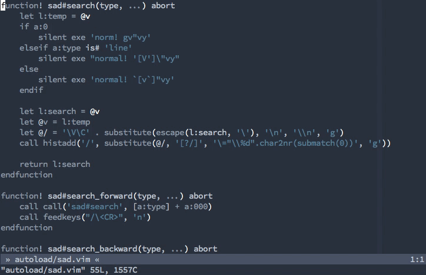

# Seek and Destroy

Simple Vim plugin that allows you to quickly search and replace occurrences of
text.

## Visualisation



## Description

This plugin provides quick search and replace mapping. Example

```
ab|ba <- `|` denotes cursor
baba
abba
```

After `siwtest<ESC>` looks like:

```
|test
baba
abba
```

Nothing impressive? I agree, the same could be achieved via `ciwtest<ESC>`, but
everything changes after you press `.`.

```
test
baba
|test
```

Wooot? What kind of magic is that? Oh, and this also works on visual selections.
Nice.

Also by the chance (and because it is also part needed for this plugin) it
provides visual `*` and `#`.

## FAQ

### But what about default `s` and `S` behaviour?

Just use `c_` or `cc`.

### But what about interference between this and [vim-sneak][]?

Create your own maps:

```vim
" Normal mode
nmap <leader>s <Plug>(sad-change-forward)
nmap <leader>S <Plug>(sad-change-backward)

" Visual mode
xmap <leader>s <Plug>(sad-change-forward)
xmap <leader>S <Plug>(sad-change-backward)
```

### Are there any easter eggs about name?

Not yet. And ever if there would be, then what is the point in telling you
anyway?

## Todo

- [x] ~~allow setting register which will contain changed text~~
- [x] ~~do not remap `s` and `S` if there already exist any mapping~~
- [x] turn search highlight right after `s{movement}`

[vim-sneak]: https://github.com/justinmk/vim-sneak
